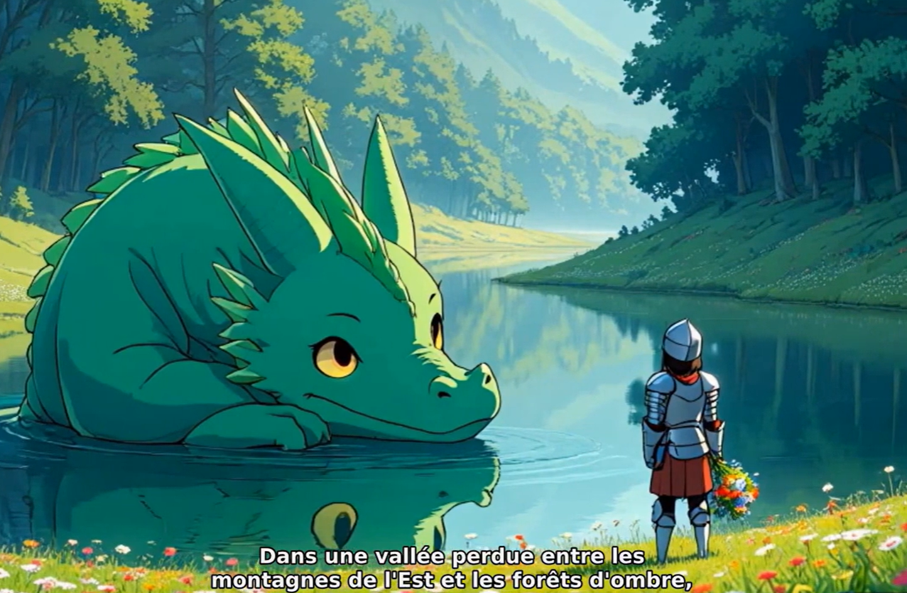

# AI Video Creator – Automated Story Video Generator



**Goal:**
A fully automated system that creates complete story-based videos: script writing, image generation, voice synthesis, subtitles, editing, and background music.

You can check more examples on [YouTube – Labelle Histoire du Soir](https://www.youtube.com/@Labellehistoiredusoir).
---

## Stack

**Core:**

* Python
* SQLite
* uv for environment and dependency management
* ruff for linting and pre-commit checks

**AI Components:**

* Leonardo AI API – image generation
* GitHub Models (Mistral and OpenAI) – story generation
* Whisper – audio detection and transcription
* Coqui TTS – text-to-speech voice synthesis

---

## Installation

1. Install ffmpeg (required for audio/video processing):

   ```bash
   sudo apt install ffmpeg
   ```
2. Install dependencies with uv:

   ```bash
   uv sync
   ```

---

## Usage

The main script uses `argparse` to handle commands corresponding to each stage of the video generation pipeline.

### Command syntax

```bash
uv run python magic_story.py [action] [--count N]
```

### Available actions

| Action     | Description                                                                |
| ---------- | -------------------------------------------------------------------------- |
| `write`    | Generates and stores the story in JSON format (text only).                 |
| `voice`    | Generates all voice parts based on the story.                              |
| `generate` | Builds the final video with subtitles, transitions, and background music.  |
| `all`      | Runs the full pipeline: story writing → voice generation → video assembly. |

### Example

```bash
uv run python magic_story.py all --count 3
```

This command will generate three complete videos automatically.

---

## Principle of Operation

### Story and Text

* Start from a simple idea or concept; the AI generates a child-friendly story.
* The system also creates a suitable introduction and outro.

### YouTube Metadata

* Automatically generates title, description, and tags for YouTube upload.

### Image Generation

* Produces images for each scene in five visual styles:

  * Ghibli
  * Pixar
  * Pencil drawing
  * Classic
  * DreamWorks
* Physical descriptions of the characters are included in each prompt to ensure visual consistency across images.

### Automatic Editing

* Generates voice narration.
* Adds fade-in and fade-out transitions.
* Applies camera motion effects.
* Creates and overlays subtitles.
* Selects and integrates background music.

### Modes of Use

* Full automation using Leonardo AI for image generation.
* Or manual mode, allowing the user to generate and import their own images.

---

## API Usage Summary

| Function                         | Approximate number of API calls       |
| -------------------------------- | ------------------------------------- |
| Story generation (GitHub Models) | 1 per prompt                          |
| YouTube metadata generation      | 3 (title, description, tags)          |
| Intro/outro generation           | 2                                     |
| Image generation                 | X (depends on number of pages/scenes) |

---

## Project Structure

```
ai-content-creator/
│
├── magic_story.py           # Main entry point – orchestrates the pipeline
├── video_story_builder.py   # Assembles and edits the video
├── voice_generator.py       # Generates narration with Coqui TTS
├── subtitle_generator.py    # Creates and syncs subtitles
├── transcript.py            # Uses Whisper for audio transcription
├── data/                    # Storage for stories, audio, images, videos
└── pyproject.toml           # Project dependencies and configuration
```

---

## Summary

This project combines storytelling, AI-generated visuals, and audio synthesis to produce ready-to-publish story videos for YouTube — automatically, from concept to final render.

---